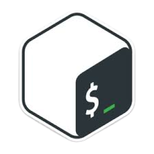

<!--

  

<h1 align=center>❗ようこそ❕</h1>-->

  

   Hi I'm Richard, a Cyber Security Student from Indonesia. I'm on my Journey to explore what the Cyber Security World has to offer, also Blockchain world.      Learning something new every day is a valuable and exciting opportunity that I welcome with open arms! 

  

  

    
    
    
    
    
    
    
  

 
    
    &nbsp;
    

<!--
**AKROM-A/AKROM-A** is a ✨ _special_ ✨ repository because its `README.md` (this file) appears on your GitHub profile.
Here are some i
deas to get you started:
- 🔭 I’m currently working on ...
- 🌱 I’m currently learning ...
- 👯 I’m looking to collaborate on ...
- 🤔 I’m looking for help with ...
- 💬 Ask me about ...
- 📫 How to reach me: ...
- 😄 Pronouns: ...
- ⚡ Fun fact: ...
-->
